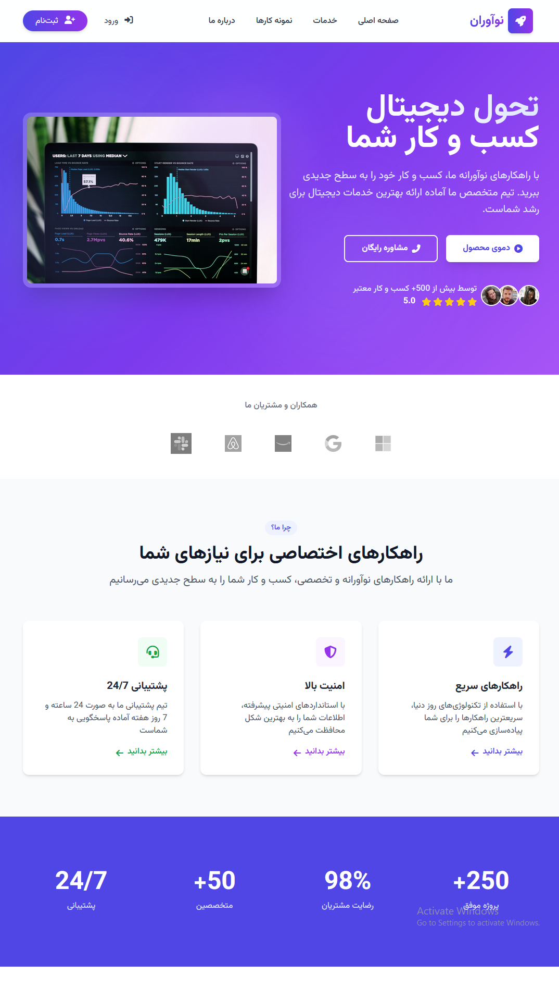

# 🌐 وب‌سایت احراز هویت و مدیریت کاربران با لاراول

این پروژه یک سیستم کامل احراز هویت (Authentication) با استفاده از فریم‌ورک قدرتمند **Laravel** است که شامل امکاناتی همچون ثبت‌نام، ورود، خروج، بازیابی رمز عبور، صفحه مقالات، مشاهده پیام‌های سیستمی و ... می‌باشد. رابط کاربری پروژه با استفاده از **Tailwind CSS** طراحی شده تا ظاهری مدرن و ریسپانسیو داشته باشد.

## 📌 ویژگی‌های اصلی

-   ثبت‌نام کاربر با اعتبارسنجی سمت سرور
-   ورود ایمن کاربران
-   خروج از حساب کاربری
-   امکان بازیابی رمز عبور از طریق ایمیل (با ارسال لینک به ایمیل کاربر)
-   صفحه لیست پست‌ها (پس از ورود کاربر قابل مشاهده است)
-   پیغام‌های سیستمی (success و error) در صفحات فرم
-   طراحی تمیز و کاربرپسند با استفاده از TailwindCSS
-   محافظت از مسیرها با Middleware
-   قابلیت مشاهده تصویر مشخص
-   امکان ارسال پیام مستقیم از طریق:
    -   [اینستاگرام](https://instagram.com/matinhasanpour_)
    -   [تلگرام](https://t.me/mattinhasanpour)
    -   ایمیل مستقیم به توسعه‌دهنده

## 📁 ساختار صفحات

### 1. صفحه اصلی (home)

صفحه ساده‌ای برای معرفی پروژه.

### 2. احراز هویت (auth)

-   `login.blade.php`  
    فرم ورود کاربران به سیستم همراه با دکمه نمایش/مخفی کردن رمز عبور.

-   `register.blade.php`  
    فرم ثبت‌نام کاربران با اعتبارسنجی کامل.

-   `forgetPassword.blade.php`  
    فرم بازیابی رمز عبور که لینک بازیابی را به ایمیل کاربر ارسال می‌کند.

-   `resetPassword.blade.php`  
    صفحه وارد کردن رمز عبور جدید همراه با اعتبارسنجی.

### 3. لیست پست‌ها (posts/index.blade.php)

لیست پست‌ها فقط بعد از ورود به سیستم قابل مشاهده است.

## ⚙️ مسیرها (Routes)

```php
// Auth routes
Route::get('/register', [AuthController::class , 'register'])->name('register');
Route::post('/register', [AuthController::class , 'registerPost'])->name('register.post');
Route::get('/login',[AuthController::class, 'login'])->name('login');
Route::post('/login',[AuthController::class, 'loginPost'])->name('login.post');
Route::get('/logout',[AuthController::class, 'logout'])->name('logout');

// Password reset
Route::get('/forget-password', [ForgetPasswordController::class , 'forgetPassword'])->name('forgetPassword');
Route::post('/forget-password', [ForgetPasswordController::class , 'forgetPasswordPost'])->name('forget.password.post');
Route::get('/reset-password/{token}', [ForgetPasswordController::class , 'resetPassword'])->name('reset.password');
Route::post('/reset-password', [ForgetPasswordController::class , 'resetPasswordPost'])->name('reset.password.post');

// Protected page
Route::get('/posts', [PostController::class , 'index'])->name('posts.index')->middleware('auth');
```

## 🔒 امنیت

-   استفاده از توکن CSRF در فرم‌ها
-   ذخیره رمز عبور به صورت هش‌شده با Bcrypt
-   اعتبارسنجی قوی در سرور
-   Token منحصر به‌فرد و تاریخ‌دار برای بازیابی رمز عبور

## 💻 تکنولوژی‌های استفاده‌شده

| تکنولوژی     | توضیح                        |
| ------------ | ---------------------------- |
| Laravel      | فریم‌ورک اصلی PHP            |
| TailwindCSS  | طراحی رابط کاربری واکنش‌گرا  |
| MySQL        | پایگاه‌داده                  |
| Mail Service | ارسال ایمیل بازیابی رمز عبور |
| Blade        | موتور قالب برای صفحات        |

## 🧪 نحوه اجرای پروژه

1. کلون کردن پروژه:

```bash
git clone https://github.com/MattinHasanpour/NoAvaran.git
```

2. نصب وابستگی‌ها:

```bash
composer install
```

3. تنظیم فایل `.env` و اجرای Migrations:

```bash
cp .env.example .env
php artisan key:generate
php artisan migrate
```

4. اجرای سرور توسعه:

```bash
php artisan serve
```

## 📸 تصاویر پروژه

| 

## 📬 تماس با من

-   ✉️ ایمیل: mattinhasanpour01@gmail.com
-   💬 [تلگرام](https://t.me/mattinhasanpour)
-   📸 [اینستاگرام](https://instagram.com/matinhasanpour_)

## ✅ سایر امکانات پیشنهادی (در آینده)

-   ارسال ایمیل تایید ثبت‌نام
-   قابلیت بارگذاری عکس پروفایل
-   پنل مدیریت کاربران
-   بلاگ اختصاصی
-   نوتیفیکیشن‌های درون‌سیستمی

## ⚖️ مجوز

این پروژه تحت لایسنس MIT ارائه شده است. شما می‌توانید آن را برای هر نوع استفاده شخصی یا تجاری توسعه دهید.

> ساخته‌شده با ❤️ توسط متین
